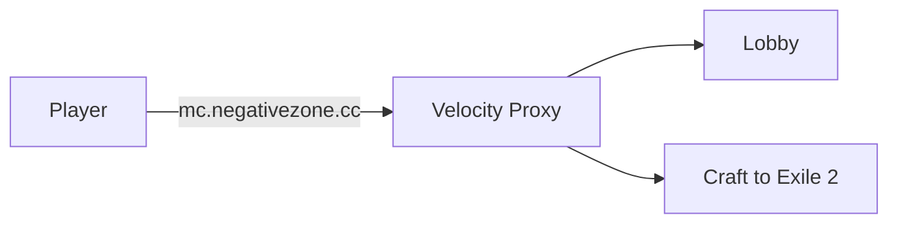

# NegativeZone Minecraft Network
{: .fs-9 }

Welcome to the NegativeZone wiki — your hub for server guides, setup instructions, and info.
{: .fs-6 .fw-300 }

---

## Quick Info

| | |
|---|---|
| **Server Address** | `mc.negativezone.cc` |
| **Minecraft Version** | 1.20.1 |
| **Modpack** | Craft to Exile 2 (CurseForge) |
| **Mod Loader** | Forge |
| **Java Version** | 17 |

---

## Getting Started

New here? Follow the [Player Onboarding Guide]() to get set up and connected.

---

## Server Architecture

Players connect to `mc.negativezone.cc` → hit the **Velocity proxy** → land in the **lobby** → get forwarded to the **Craft to Exile 2** modded server.

The lobby is a lightweight Forge 1.20.1 server in adventure/peaceful mode.
C2E2 is the main gameplay server running the full Craft to Exile 2 modpack.
