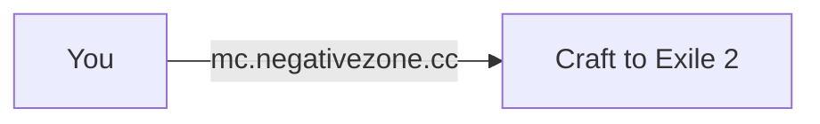

# NegativeZone Minecraft Network
{: .fs-9 }

Welcome to the NegativeZone wiki — your hub for server guides, setup instructions, and info.
{: .fs-6 .fw-300 }

---

## Quick Info

| | |
|---|---|
| **Server Address** | `mc.negativezone.cc` |
| **Minecraft Version** | 1.20.1 |
| **Modpack** | Craft to Exile 2 (CurseForge) |
| **Mod Loader** | Forge |
| **Java Version** | 17 |

---

## Getting Started

New here? Follow the [Player Onboarding Guide]() to get set up and connected.

---

## How it works

When you join `mc.negativezone.cc`, you're automatically connected straight
into the **Craft to Exile 2** world. No commands needed.

If C2E2 is down for maintenance, you'll get a "Server unavailable" message —
wait a minute and try again.
